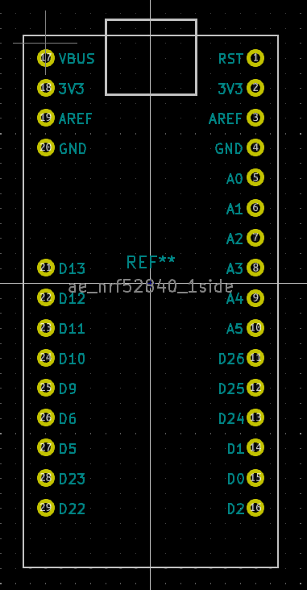
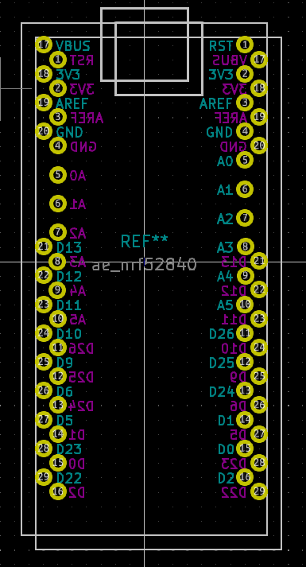

# ae_nrf52840

秋月のnrf52840のkicadフットプリントです。
両面用と片面用があります。両面用はリバーシブルに利用してください。

リンク: [https://akizukidenshi.com/catalog/g/gK-17484/](https://akizukidenshi.com/catalog/g/gK-17484/)

MIT licenceで公開していますので、自由にお使いください。

# img 
## 片面版(ae_nrf52840_1side.kicad_mod)

## 両面版(ae_nrf52840.kicad_mod)
